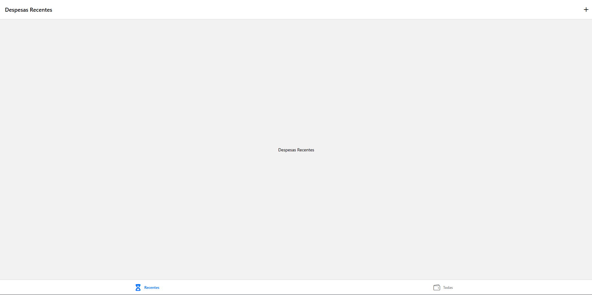
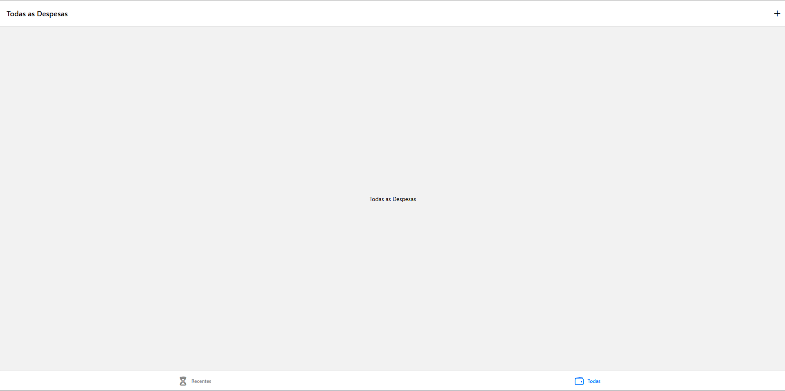
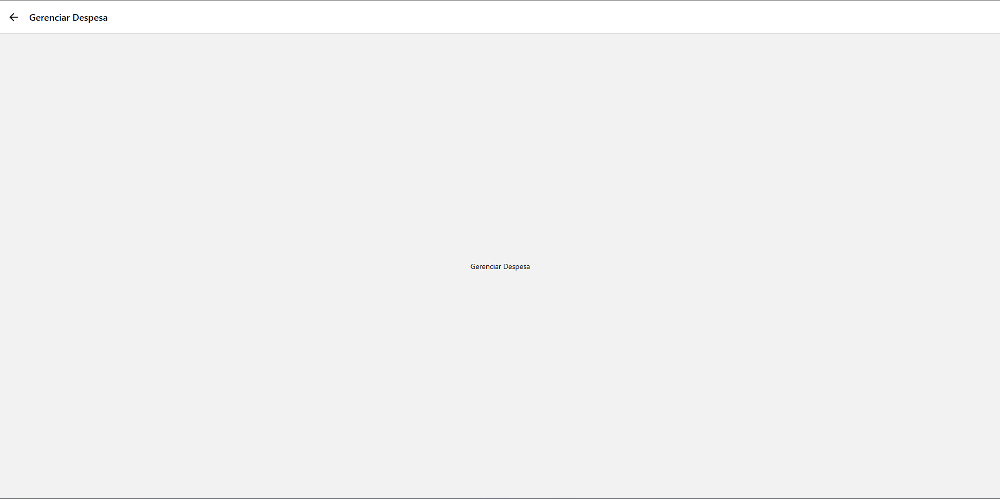
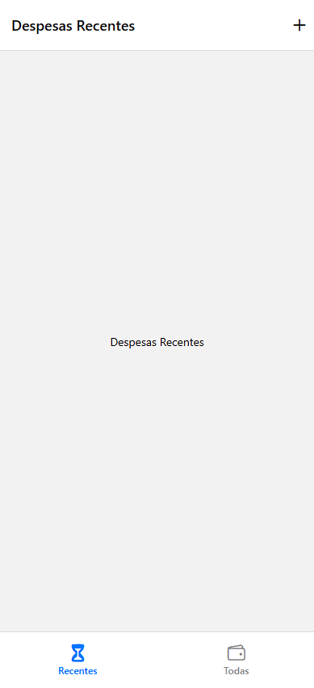
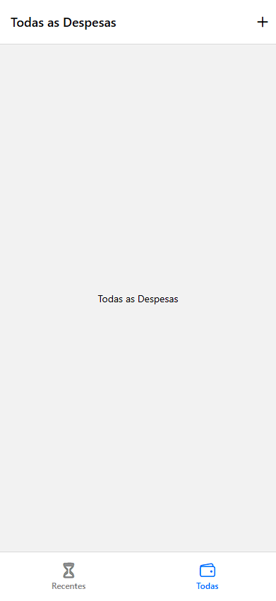
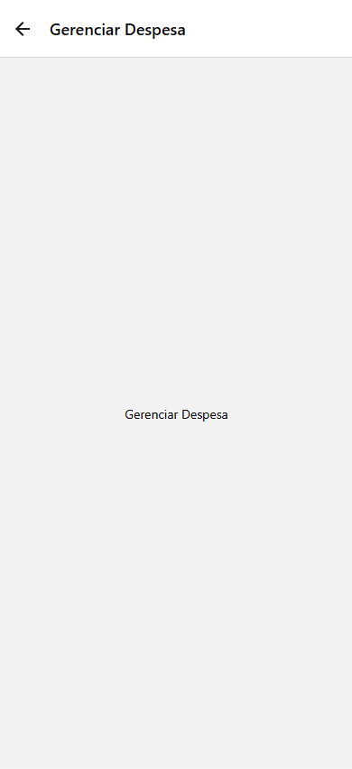

# Atividade 4 — Navegação com React Navigation

Atividade da disciplina **Programação para Dispositivos Móveis (PDM)**, desenvolvida com **React Native** e **Expo**.

## Objetivo

Construir a estrutura de navegação de um aplicativo de controle de despesas usando **Bottom Tabs** e **Native Stack** do React Navigation, além de criar um componente reutilizável de botão com ícone.

> O foco desta atividade é a navegação entre telas. O cadastro e o armazenamento de despesas não fazem parte do escopo.

## Tecnologias utilizadas

- React Native e Expo (SDK 57)
- React Navigation: `@react-navigation/native`, `@react-navigation/bottom-tabs` e `@react-navigation/native-stack`
- `@expo/vector-icons` (Ionicons)
- `react-native-screens` e `react-native-safe-area-context`

## Estrutura do projeto

```text
Atividade-screen/
├── components/
│   └── IconButton.js
├── screens/
│   ├── DespesasRecentes.js
│   ├── TodasDespesas.js
│   └── GerenciarDespesa.js
├── prints/
│   ├── 01-desktop-recentes.png
│   ├── 02-desktop-todas.png
│   ├── 03-desktop-gerenciar.png
│   ├── 04-mobile-recentes.png
│   ├── 05-mobile-todas.png
│   └── 06-mobile-gerenciar.png
├── App.js
├── app.json
├── index.js
├── package.json
└── package-lock.json
```

## Telas e navegação

O aplicativo é envolvido por um `NavigationContainer`. A navegação principal utiliza uma **Native Stack**, com as telas:

- **Despesas:** contém o navegador de abas e não exibe o cabeçalho da Stack.
- **GerenciarDespesa:** exibe o texto “Gerenciar Despesa” e permite retornar à tela anterior.

Dentro de **Despesas**, as **Bottom Tabs** apresentam:

| Tela | Título | Rótulo da aba | Ícone |
| --- | --- | --- | --- |
| `DespesasRecentes` | Despesas Recentes | Recentes | `hourglass` |
| `TodasDespesas` | Todas as Despesas | Todas | `wallet-outline` |

Os rótulos das abas utilizam tamanho de fonte **12**. A barra inferior recebeu ajustes de altura e espaçamento para evitar que os rótulos fiquem cortados em telas estreitas. Cada tela contém uma `View` com o texto de identificação centralizado.

O cabeçalho das duas abas apresenta um botão `+` que abre `GerenciarDespesa`. O componente reutilizável `IconButton`, criado em `components/IconButton.js`, recebe as propriedades `icon`, `size`, `color` e `onPress`, utiliza `Pressable` com `Ionicons` e aplica **opacidade 0,5** durante o pressionamento.

## Como executar

**Pré-requisitos:** Node.js e npm instalados.

No terminal, acesse a pasta do projeto e instale as dependências:

```bash
cd praticas/Atividade-screen
npm install
```

Inicie o Expo:

```bash
npx expo start
```

Para abrir no navegador, pressione `w` no terminal, ou execute:

```bash
npm run web
```

Para tentar abrir no Android, utilize o Expo Go compatível com a versão do projeto e escaneie o QR Code exibido pelo Expo. O computador e o celular devem conseguir se comunicar pela rede. Esse procedimento foi tentado, mas a conexão não foi estabelecida no ambiente utilizado.

## Verificação funcional

A navegação foi **testada manualmente no Expo Web**, com os seguintes fluxos concluídos:

- [x] Alternar entre as abas **Recentes** e **Todas**.
- [x] Voltar à aba **Recentes**.
- [x] Abrir **Gerenciar Despesa** pelo botão `+` do cabeçalho.
- [x] Retornar de **Gerenciar Despesa** para as abas.

### Limitação do teste no Android

Foi feita uma tentativa de execução em um celular Android pelo **Expo Go**. O QR Code apareceu, mas o aplicativo não conseguiu se conectar ao servidor de desenvolvimento. Também foi tentada a inicialização com `npx expo start --tunnel --clear`, sem sucesso: após instalar o `@expo/ngrok`, o Expo retornou a mensagem `CommandError: Install @expo/ngrok@^4.1.0 and try again`.

A causa não foi confirmada. Configurações de rede, ambiente de desenvolvimento e compatibilidade de ferramentas são possibilidades a investigar; não há evidência suficiente para atribuir o problema a uma versão desatualizada no computador da faculdade. **A visualização mobile documentada abaixo foi feita pelo modo de simulação de dispositivo do Chrome, não no Android ou no Expo Go.**

Não foram executados testes automatizados. Os fluxos de navegação descritos acima foram validados manualmente no Expo Web.

## Evidências

As seis capturas foram realizadas no **Expo Web**: três no navegador em formato desktop e três na simulação de celular do Chrome. Elas mostram as telas e o resultado visual da navegação, mas não constituem evidência de execução nativa no Android.

### Visualização desktop

**Despesas Recentes**



**Todas as Despesas**



**Gerenciar Despesa**



### Visualização mobile — simulação no Chrome

**Despesas Recentes**



**Todas as Despesas**



**Gerenciar Despesa**



## Organização da entrega

Desenvolvimento realizado na branch `feature/atividade-screen`, relacionado à [Issue #11](https://github.com/xande0804/IESB-PDM-OESTE/issues/11). A entrega foi realizada por meio do [Pull Request #12](https://github.com/xande0804/IESB-PDM-OESTE/pull/12), aberto da branch `feature/atividade-screen` para a `main`.
