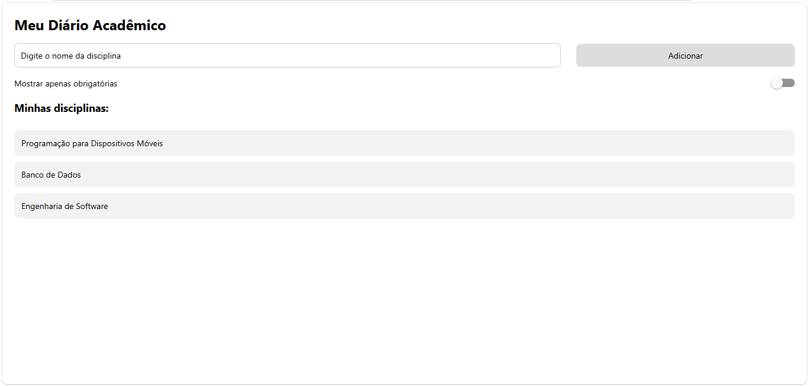

# MeuDiarioAcademico

Aplicativo desenvolvido para a Atividade 01 da disciplina de Programação para Dispositivos Móveis.

O projeto apresenta uma interface simples para cadastro de disciplinas, utilizando React Native e Expo. A atividade trabalha conceitos de componentes, import/export, StyleSheet, Flexbox, SafeAreaView, Pressable e Switch.

## Criação do projeto

O projeto foi criado com o comando:

```bash
npx create-expo-app@latest MeuDiarioAcademico --template blank
```

## Execução

Para executar o projeto:

```bash
npx expo start
```

Para executar no navegador:

```bash
npx expo start --web
```

## Funcionalidades

* Campo para informar o nome da disciplina
* Botão `Adicionar`
* Lista de disciplinas
* Layout utilizando Flexbox
* Rótulos organizados em `labels.js`
* Uso de SafeAreaView
* Botão com `Pressable` e feedback visual ao pressionar
* Switch `Mostrar apenas obrigatórias`

## Evidência


