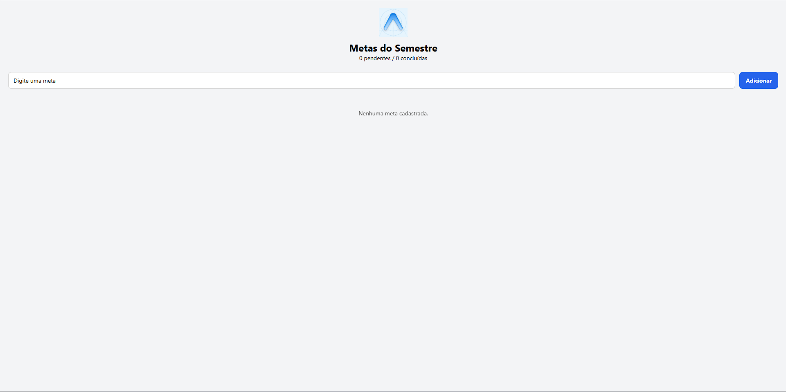
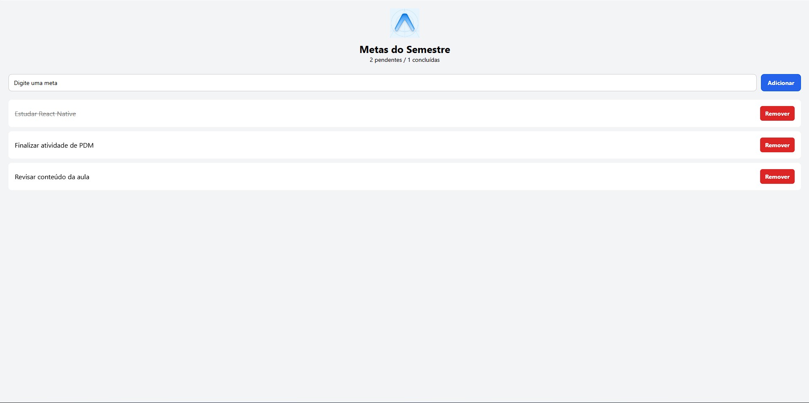

# 💻 Prática 05 — MetasSemestre

Aplicativo desenvolvido em React Native com Expo para cadastrar e acompanhar metas acadêmicas do semestre.

O projeto utiliza estado, componentização, eventos, FlatList e persistência local com AsyncStorage.

---

## 🎯 Funcionalidades

- Adicionar metas acadêmicas
- Impedir o cadastro de metas vazias
- Remover metas
- Marcar metas como concluídas
- Desmarcar metas concluídas
- Contador de metas pendentes e concluídas
- Persistência das metas mesmo após recarregar ou reabrir o aplicativo
- Feedback visual nos elementos clicáveis

---

## ✅ Como marcar uma meta como concluída

Para marcar uma meta como concluída, basta **clicar em qualquer lugar da barra da meta**.

Ao concluir:

- o texto fica riscado;
- a meta passa a ser contabilizada como concluída;
- o contador do cabeçalho é atualizado.

Para voltar a meta para pendente, basta clicar novamente na barra.

> O botão **Remover** continua sendo usado somente para excluir a meta.

---

## 🧩 Componentização

O projeto possui dois componentes na pasta `components/`:

### `MetaInput.js`

Responsável pelo campo de texto e botão de adicionar.

Props utilizadas:

- `value`
- `onChangeText`
- `onAdd`

### `MetaList.js`

Responsável por exibir as metas através de uma `FlatList`.

Props utilizadas:

- `metas`
- `onDelete`
- `onToggle`

---

## 💾 Persistência com AsyncStorage

As metas são armazenadas localmente utilizando a chave:

```text
@metas_semestre
```

### useEffect de carregamento

No `App.js`, existe um `useEffect` executado na montagem do aplicativo.

Ele utiliza:

```javascript
AsyncStorage.getItem('@metas_semestre')
```

Caso existam metas armazenadas, os dados são convertidos utilizando `JSON.parse()` e colocados novamente no estado através de `setMetas()`.

Também foi utilizado `try/catch` para tratar possíveis erros durante o carregamento.

### useEffect de salvamento

Existe também outro `useEffect`, responsável por salvar as metas sempre que a lista for alterada.

Os dados são convertidos utilizando:

```javascript
JSON.stringify(metas)
```

e armazenados utilizando:

```javascript
AsyncStorage.setItem()
```

Foi utilizado um estado de controle para evitar que uma lista vazia seja salva antes que o carregamento inicial seja concluído.

---

## ⭐ Desafio opcional

Também foi implementado o desafio opcional da atividade.

Cada meta possui o campo:

```javascript
concluida: boolean
```

Ao clicar na barra da meta, o valor é alternado entre concluída e pendente.

Metas concluídas possuem o texto riscado.

O cabeçalho também mostra a quantidade de:

```text
X pendentes / Y concluídas
```

O estado de conclusão também é salvo no AsyncStorage.

---

## 📸 Prints

### Lista vazia



### Lista com itens


### Lista após reabrir o aplicativo



---

## ▶️ Executando o projeto

Entre na pasta do projeto:

```bash
cd MetasSemestre
```

Instale as dependências:

```bash
npm install
```

Para executar utilizando Expo Web:

```bash
npx expo start --web
```

Caso seja necessário instalar as dependências web:

```bash
npx expo install react-dom react-native-web @expo/metro-runtime
```

---

## 📦 Dependências utilizadas

```bash
npx expo install @react-native-async-storage/async-storage react-native-safe-area-context
```

---

## 🌿 Branch

```text
feature/pratica05
```
