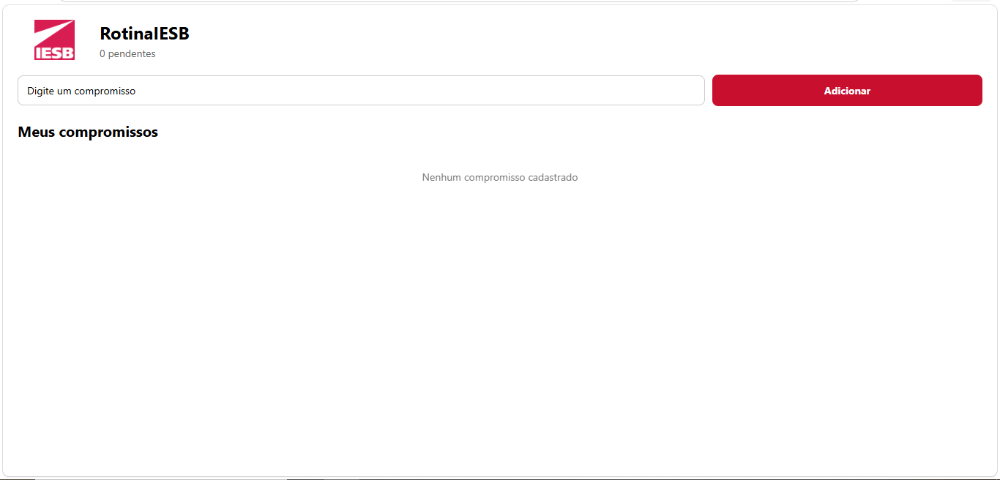
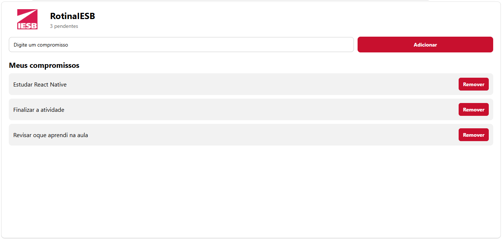

# RotinaIESB

Aplicativo desenvolvido para a disciplina de Programação para Dispositivos Móveis do IESB.

O objetivo do app é permitir o cadastro, visualização e remoção de compromissos da rotina acadêmica, mantendo os dados salvos mesmo após fechar o aplicativo.

## Criação do projeto

Comando utilizado para criar o projeto:

```bash
npx create-expo-app@latest RotinaIESB --template blank
```

Dependências instaladas:

```bash
npx expo install @react-native-async-storage/async-storage react-native-safe-area-context
```

Para executar o projeto:

```bash
npx expo start
```

Para executar no navegador:

```bash
npx expo start --web
```

## Funcionalidades

* Cadastro de compromissos
* Validação de campo vazio
* Remoção de compromissos
* Contador de compromissos pendentes
* Persistência dos dados com AsyncStorage
* Lista utilizando FlatList
* Mensagem quando não existem compromissos cadastrados

## Persistência

O aplicativo utiliza a chave:

```text
@rotina_iesb_compromissos
```

### Carregamento

O `useEffect` responsável pelo carregamento dos dados está no arquivo `App.js`.

Ele é executado quando o aplicativo é iniciado e utiliza:

* `AsyncStorage.getItem`
* `JSON.parse`

### Salvamento

O segundo `useEffect`, também localizado no `App.js`, é executado quando a lista de compromissos é alterada.

Ele utiliza:

* `JSON.stringify`
* `AsyncStorage.setItem`

## Componentes

Os componentes criados estão na pasta `components/`:

* `CompromissoInput.js`: responsável pelo campo de texto e botão de adicionar.
* `CompromissoList.js`: responsável pela exibição e remoção dos compromissos.

Também foi criado:

* `labels.js`: contém os textos utilizados pela aplicação através de exports nomeados.

## Estrutura

```text
RotinaIESB/
├── App.js
├── labels.js
├── assets/
├── components/
│   ├── CompromissoInput.js
│   └── CompromissoList.js
├── app.json
├── package.json
└── README.md
```

## Prints

### Tela vazia



### Tela com itens


### Após reabrir o aplicativo

